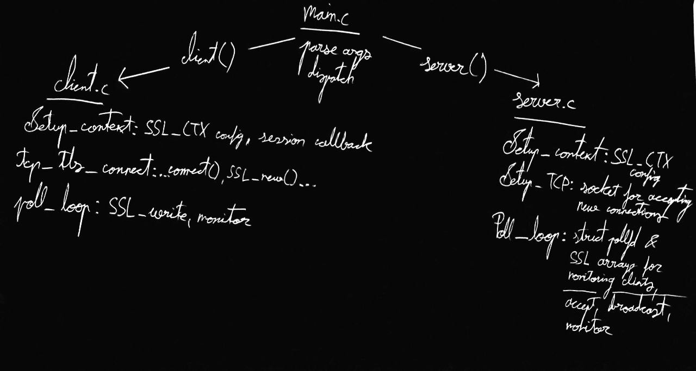

# mTLS Chat App

Secure communication over TLS using the OpenSSL library between a TCP server and up to 100 clients. Both sides must present valid certificates issued by a common CA, hence "mutual" TLS (mTLS). Server multiplexes all sockets and stdin using poll(); client connections are simultaneously tracked and properly cleaned up on disconnect. Rejects any attempts to downgrade below TLS 1.3. Upon successful connection, clients print the TLS session ticket and the server prints the IP address of the newly connected client.

Select server or client mode at run time

This is a continuation and improvement of [TCP Suite](https://github.com/Nyveruus/systems-programming/tree/main/projects/networking/tcp-suite)

## Build & Usage

```
$ make
$ ./mtlsapp server|client IP PORT CA CERT KEY
```

## Architecture




## Generate Certificates & Keys

**CA**: private key, CN & self-signed certificate

```
$ openssl req \
    -x509 \
    -nodes \
    -days 365 \
    -subj "/CN=ca" \
    -newkey rsa \
    -keyout ca_key.pem \
    -out ca_cert.pem
```
**Server**: private key & CSR (CA generates certificate)

```
$ openssl genrsa -out server_key.pem
$ openssl req -new \
    -key server_key.pem \
    -subj "/CN=server" \
    -out server_csr.pem
$ openssl x509 \
    -req \
    -days 365 \
    -in server_csr.pem \
    -CA ca_cert.pem \
    -CAkey ca_key.pem \
    -CAcreateserial \
    -out server_cert.pem
```

**Client**: private key & CSR (CA generates certificate)

```
$ openssl genrsa -out client_key.pem
$ openssl req -new \
    -key client_key.pem \
    -subj "/CN=client1" \
    -out client_csr.pem
$ openssl x509 \
    -req \
    -days 365 \
    -in client_csr.pem \
    -CA ca_cert.pem \
    -CAkey ca_key.pem \
    -CAcreateserial \
    -out client_cert.pem
```

